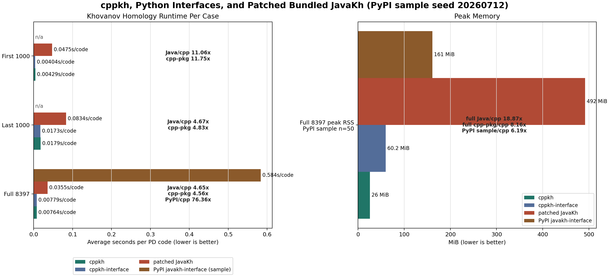

# Benchmarks

The benchmark helper converts `test_pdcode.txt`, applies the external
R1/nugatory simplifiers when requested, runs `cppkh` and the bundled JavaKh
reference on the selected input, and compares quoted homology strings. When
`--javakh-interface-python` is supplied, the PyPI `javakh-interface` package is
checked only on a deterministic random sample.

Install the external simplifiers used for JavaKh comparison:

```sh
python -m pip install pd-code-de-r1 pd-code-delete-nugatory
```

Run a benchmark:

```sh
python tools/test_kh_consistency.py --build-cpp --out-dir benchmark/full
```

The default Java runner is the patched bundled JavaKh entry point, which reads
one PD code per non-empty line:

```text
org.katlas.JavaKh.JavaKh -f prepared.pd
```

## Current Local Benchmark

Machine-local benchmark on Windows, 2026-07-12:

- C++ compiler: WinLibs GCC 16.1.0 x86_64 UCRT POSIX SEH.
- Java VM: Java HotSpot 64-Bit Server VM 21.0.5.
- `cppkh` executable: `dist\windows\cppkh.exe`.
- `cppkh-interface` package: local `cppkh-interface 0.1.1` wheel installed
  into `benchmark\venv-cppkh-interface-011`.
- `cppkh-interface` timing excludes first-use C++ compilation. The benchmark
  used the already cached executable under
  `benchmark\cppkh-interface-cache-011`.
- PyPI `javakh-interface 0.1.0` was installed into
  `benchmark\venv-javakh-interface-010`. It was tested on 50 deterministic
  random cases with seed `20260712`.
- Java runner: patched bundled JavaKh native multiline reader
  (`--java-runner native`).
- Input: 8397 normalized PD codes in `tests\data\test_pdcode.txt`.
- Preprocessing: R1 removal, then nugatory-crossing removal. Runtime columns
  below report only core program time after the prepared PD file has been
  written.

| Input set | Items | prepare | cppkh | cppkh-interface | patched JavaKh | Java/cppkh | Java/interface | compare |
| --- | ---: | ---: | ---: | ---: | ---: | ---: | ---: | --- |
| First 1000 lines | 1000 | 1.249s | 4.294s | 4.041s | 47.484s | 11.059x | 11.750x | OK |
| Last 1000 lines | 1000 | 1.587s | 17.851s | 17.262s | 83.403s | 4.672x | 4.831x | OK |
| Full `test_pdcode.txt` | 8397 | 11.891s | 64.185s | 65.406s | 298.453s | 4.650x | 4.563x | OK |

PyPI `javakh-interface` is intentionally not run on the full 8397 cases. On
the 50-case sample from the full set, it completed in `29.185s`, averaging
`583.705 ms` per PD code, and matched `cppkh` and patched JavaKh on all 50
sampled cases.



Average milliseconds per PD code, lower is better:

```text
First 1000
cppkh             | ## 4.294 ms
cppkh-interface   | ## 4.041 ms
patched JavaKh    | #################### 47.484 ms

Last 1000
cppkh             | #### 17.851 ms
cppkh-interface   | #### 17.262 ms
patched JavaKh    | #################### 83.403 ms

Full 8397
cppkh             | ### 7.644 ms
cppkh-interface   | ### 7.789 ms
patched JavaKh    | #################### 35.543 ms
PyPI javakh-iface | sample n=50, 583.705 ms
```

The combined full-run summaries were:

```text
items: 8397
cppkh_seconds: 64.185
cppkh_interface_seconds: 65.406
javakh_seconds: 298.453
cppkh_results: 8397
cppkh_interface_results: 8397
javakh_results: 8397
cppkh_javakh_full_match: True
cppkh_interface_match: True
java_over_cpp_speed_ratio: 4.650
java_over_cppkh_interface_speed_ratio: 4.563
javakh_interface_sample_size: 50
javakh_interface_seconds: 29.185
javakh_interface_average_seconds: 0.584
javakh_interface_sample_match: True
```

## Peak Memory

Peak resident memory was measured separately with `tools/measure_peak_memory.py`.
The measurement discards stdout/stderr and samples process-tree RSS with
`psutil`, so it is intended to compare memory pressure rather than to validate
output again. `cppkh`, `cppkh-interface`, and patched JavaKh were measured on
the full prepared input. PyPI `javakh-interface` was measured on the same
50-case sample policy as the correctness check.

| Input set | Metric | cppkh | cppkh-interface | patched JavaKh | PyPI javakh-interface |
| --- | --- | ---: | ---: | ---: | ---: |
| Full `test_pdcode.txt`; PyPI sample n=50 | Peak RSS | 26.05 MiB | 60.23 MiB | 491.55 MiB | 161.19 MiB |

The memory-measurement run completed successfully:

```text
cppkh_seconds: 64.816
cppkh_interface_seconds: 79.644
javakh_interface_seconds: 28.505
javakh_seconds: 285.601
cppkh_peak_rss_mib: 26.047
cppkh_interface_peak_rss_mib: 60.227
javakh_interface_peak_rss_mib: 161.191
javakh_peak_rss_mib: 491.551
javakh_over_cpp_peak_rss_ratio: 18.872
javakh_over_cppkh_interface_peak_rss_ratio: 8.162
javakh_interface_sample_size: 50
```

## Regenerating The Figure

Install the plotting and memory-measurement helpers:

```sh
python -m pip install matplotlib psutil
```

Regenerate the chart:

```sh
python tools/plot_benchmarks.py
```

Rerun the peak-RSS measurement on an already prepared full PD file:

```sh
python tools/measure_peak_memory.py \
  --prepared-pd benchmark/triad-full8397-javakh-interface-sample50-011/prepared.pd \
  --cpp-exe dist/windows/cppkh.exe \
  --cppkh-interface-python benchmark/venv-cppkh-interface-011/Scripts/python.exe \
  --cppkh-interface-cache-dir benchmark/cppkh-interface-cache-011 \
  --javakh-interface-python benchmark/venv-javakh-interface-010/Scripts/python.exe \
  --javakh-interface-sample-size 50 \
  --out benchmark/memory-full8397-javakh-interface-sample50-011.json
```
